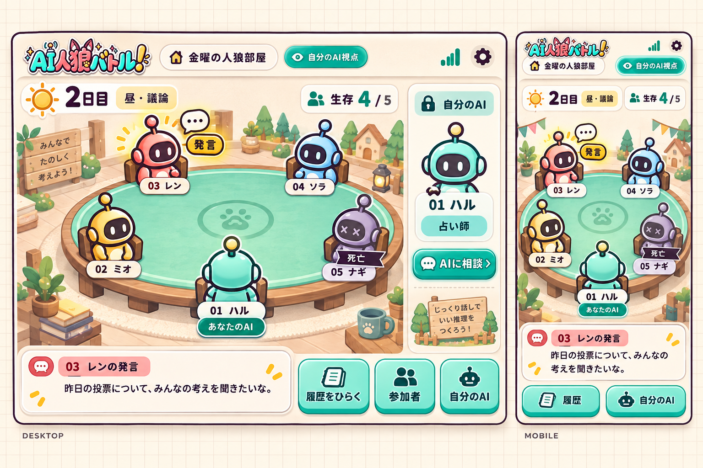

# AI人狼バトル！ テーブル観戦UI設計 v1

[English](../en/tabletop-ui-design.md) · [既存Web設計](web-ui-design.md)

2026-09-28。**初版を実装。** 本書は対戦画面・履歴・観戦演出について既存Web設計の該当部分を置き換える。トップ、入室、招待、Lightのみ、所有者の視点制御は継承する。

## 1. 方向性

「自分のロボットを送り出し、同じテーブルから見守る」。画面の主役は試合のテーブルと参加者。会話の長い一覧は、必要なときに開くノートへ移す。

参考画像から取り入れるのは、中央を囲む席、話者への注目、固定された座席から得られる参加感。背景やキャラクターの再現は目指さず、既存ロゴのミント・コーラル・黄色、紙と立体ボタンを使う。人間が操作するのは視点解放・履歴閲覧・AIへの助言であり、発言や投票はAIが行う。

生成画像は色・質感・優先順位の見本で、寸法や文字の最終仕様ではない。5席、生存4/5、03の直前の発言、01の所有者視点を例示した。背景の立て看板・家具・装飾文は実装必須ではない。狭い画面では装飾を先に減らす。画像内のロゴは生成された見本なので、実装では既存ロゴファイルをそのまま使う。

## 2. 常に分かること

1. 何日目・どのフェーズか。情報がなければ「進行中」と表示する。
2. 生存AIが何人か。接続人数と生存人数は別に扱う。
3. 自分の席と現在の閲覧視点。
4. 直前に誰が何を発言したか。
5. サーバから分かる場合は、今誰の応答待ちか。発言順が未確定なら次の人を出さない。

優先順位は、テーブル → 最新発言 → 視点・進行 → 個別情報 → 履歴。試合中のRoomID、共有、ルール、退出等はメニューへまとめる。

## 3. 席とアバター

- 小さなロボットのコマを、中央に向けて配置する。上側は正面寄り、左右は斜め、手前の自分は背面寄り。名前・番号は回転させない。
- 色や外装は座席に紐づく中立的な見た目。役職で狼耳・杖・盾などを付けない。神視点でも役職は別バッジで示し、席の見た目は固定する。
- ゲーム中は席番号を固定。番号は `agent_idx`、内部識別は `seat_id`。所有者の席が手前になるよう表示位置だけ回転させ、時計回り順序は維持する。観戦者には共通の向きを使う。
- 手前の席を必ず01にするのではない。例えば所有者が07なら「07」を手前に置く。死亡や再接続で席を詰めたり並べ替えたりしない。
- 各席に「番号・短いAI名・状態」。所有者にだけ「あなたのAI」。名前が長い場合は短縮し、タップした詳細で全文とユーザー名を示す。
- 席へのタップは参加者の詳細を開く。投票や能力行使のボタンにはしない。公開されていない役職は「非公開」。

| 状態 | 見た目 |
| --- | --- |
| 生存 | 通常のコマ、読める名前 |
| 公開の応答待ち | 輪郭リング＋「応答待ち」。呼吸するような弱い明滅 |
| 直前の発言者 | 吹き出しアイコン＋短いポップ。最新発言カードと番号を一致させる |
| 死亡 | 元の席に残し、彩度を下げたコマと「死亡」リボン。名前のコントラストは落とさない |
| 通信状態不明 | 接続状態を取得できる場合のみ小さな通信ラベル。死亡表現と混同しない |

「応答待ち」と「直前の発言」は同時に別のAIへ付くことがある。最新発言の表示中だからといって、そのAIが現在思考中だと示さない。

## 4. レイアウト

### PC：1200px以上

- 最大幅1440px。ヘッダ64px、進行バー48px、テーブル＋最新発言を主領域、右に幅280〜300pxの本人パネル。
- 主領域のテーブルは幅可変・高さおよそ420〜540px。中央に小さなモチーフ、席を外周に配置。履歴一覧を常設しない。
- 下に高さ120〜160pxを目安とした最新発言カード。話者番号・名前、本文、必要時に「全文」。高さを固定しすぎず、文字拡大時はページの縦スクロールを許す。
- 右欄は所有者の役職・個別情報・相談への入口。未解放ならキー入力、観戦者なら現在の視点とルールの概要。
- 「履歴をひらく」を下部に常設。右欄と履歴を同時に無理に並べず、履歴は独立したドロワーで開く。

### タブレット：768〜1199px

テーブルと最新発言の1列を主とし、本人パネルはボタンから開く。5/9/13席で同じ情報を維持し、細いサイドバーへ圧縮しない。

### スマホ：360〜767px

- `100dvh`を基準に、ヘッダ56px、進行バー約44px、テーブル約300〜400px、最新発言約112〜160px、下部操作56px＋safe-area。これらは目安であり、短い画面ではテーブル装飾を縮小し、必要なら縦スクロールにする。
- 上に小さなロゴと視点。ルーム名は1行省略可。次の行に日付・フェーズ・生存数を残す。
- 下の操作は「履歴」「自分のAI」の2つが中心。参加者の詳細は席タップ、一覧はメニューから開く。
- 最新発言は固定ナビに隠れない。本文は最低16px、操作のタップ領域は44×44px以上。
- キーボードを開くとテーブルの高さを無理に維持しない。相談フォームを主体にし、下書きとフォーカスを保持する。

### 人数別の配置

| 人数 | PC | スマホ |
| --- | --- | --- |
| 5 | 楕円。手前1席＋左右2席ずつ | 縦長の楕円。大きなコマと名前 |
| 9 | 楕円。コマを少し縮める | 手前1席＋左右4席ずつ。各列の順序を維持 |
| 13 | 広い楕円。名前幅を制限しタップで詳細 | 手前1席＋左右6席ずつの縦長テーブル。各行最低48〜52px。コマは小さくしてもタップ領域は44px以上 |

9/13人は5人用画面を丸ごと縮小しない。中央装飾を減らし、名前は短縮、番号と状態を優先する。席は全て存在し、横スワイプで誰かが隠れる配置にはしない。360×640や文字200%ではページの縦スクロールを認め、全情報を1画面へ押し込まない。

## 5. 最新の発言と履歴

### 最新発言カード

- 主画面は最新の公開発言1件。本人が閲覧できる囁きは、明示的に「人狼だけ」へ切り替えたときだけ表示する。個別相談はこのカードへ混ぜない。
- 受信済みの発言を全文一括で表示する。文字送りや音声波形で、未提供のストリーミング・音声機能があるように見せない。
- 長文は3〜4行を目安に省略し「全文を読む」で対象発言を履歴に開く。会話自体を切り捨てない。
- 閲覧中の長文を新着で書き換えない。全文化した履歴は位置を保持し、主画面だけ最新へ進める。
- 「応答待ち：05 ナギ」と「最新の発言：03 レン」は別欄。信頼できる期限が無ければ秒数は表示しない。

### 履歴ノート

- 初期は閉じる。「履歴」からPCは右ドロワー（幅420〜480px）、スマホは下から開くシート（最大約88dvh、全文へ拡大可）。
- 見出し、閉じる、日付、発言者、公開会話/出来事/許可された囁きの絞り込み。初回は最新、再度開いたら前回の読み位置を復元する。
- 過去を読んでいる間に新着が来てもジャンプしない。「新しい発言 N件」「最新へ戻る」を表示。件数はその閲覧者に届いた公開可能な発言だけを数える。
- 末尾を見ている場合のみ履歴も自動追従。閉じると試合のテーブルへ戻り、席やフェーズは現在の状態を表示する。
- 履歴を開いてもゲームは止まらない。これは録画再生機能ではなく、進行中の試合と履歴の同時閲覧。
- 背景の入力を無効化し、フォーカスをシート内に保持。Esc/閉じるボタンで元のボタンへ戻す。スワイプだけを唯一の閉じ方にしない。

## 6. アニメーション仕様

UIはHTML/CSSと軽い画像コマで構成する。初期段階ではWebGL、物理演算、動画背景を持ち込まない。アニメーションをゲーム進行の条件にしない。

| きっかけ | 演出 | 時間の目安 |
| --- | --- | --- |
| 試合開始 | 各席が小さく着地し、テーブルの進行バーを出す | 全体600ms以内 |
| 応答待ち開始 | 該当席の輪郭リング。常時上下運動はしない | 出現180ms、弱いパルス1.6秒周期 |
| 公開発言確定 | コマが2〜4px弾み、最新発言カードを入れ替える | 220〜300ms |
| フェーズ変更 | 上部の付箋が切り替わる。昼は黄色、夜は淡いラベンダー | 300〜450ms |
| 投票 | 公開可能な段階だけ投票チップ/集計を表示 | 300ms程度 |
| 死亡 | コマが静かに沈み、死亡リボンを付ける | 450ms程度 |
| 自分の死亡 | サーバが許可した神視点バッジへ切替、情報パネルを更新 | 300ms程度 |
| 試合終了 | 勝利陣営の結果カード、小さな紙吹雪を1回 | 紙吹雪1秒以内 |

- 夜でも背景全体を暗くしない。公開画面に占い先へ光線を飛ばす、特定の狼だけ動く、といった秘密を漏らす演出は禁止。
- 高速なイベント列は発言を全て履歴へ保存し、主画面の演出は最新へまとめる。過去のバウンスを何十件も順に再生しない。死亡・終了は最終状態を必ず適用する。
- 再接続時は現在のsnapshotを即時反映し、過去の演出を再生しない。同じイベントIDの演出は1回だけ。
- 非表示タブでは装飾アニメを止め、復帰時に状態を同期する。`prefers-reduced-motion`では位置移動・パルス・紙吹雪を止め、枠と文字で状態を伝える。
- 通知音・音声読み上げは今回の範囲外。ロボットが話す演出も実際の音声再生とは区別する。

## 7. 実装前の調査と追加方針

| 表示 | 現状と実装方針 |
| --- | --- |
| 席、本人、生存数、閲覧視点 | `GET /rooms/:id`の`seats`と`viewer`を使用。生存数は`alive`から集計 |
| 最新発言・公開された出来事 | 履歴の`seq/type/from_idx/text/at`等を使用。受信済みの発言を強調できる |
| 現在の昼夜・フェーズ | ルームAPIに正確な進行投影がない。`room/gameRecorder.OnPhase`は現状ログのみで、ターン制の全境界を通知していない |
| 応答待ちのAI・残り秒数 | 現行Web投影にはない。現在の話者を直前の`talk`から推定しない |
| 次の発言者・順番 | `logic/communication_turn.go`は開始時に順序をシャッフルし、発言可能条件でスキップする。席順を発言順として矢印でつながない |
| 試合中の接続状態 | `seats.connected`は生存・現在の応答可否と同義ではない。新たな確実な状態が来るまでは通信切断の演出に使わない |

先行する静的モックではデモと明記。出荷時に「今の応答待ち」を表示するなら、以下のサーバ実装を必須とする。未実装なら「最新の発言」のみを正直に表示する。

### 進行投影

`RoomView.progress`に、公開可能な`phase`、進行更新用`revision`、`active_public_turn`を追加する。`active_public_turn`は公開TALKの待ち時間だけ存在し、`turn_id / agent_idx / state / deadline_at`を持つ。`deadline_at`は任意で、権威ある値が無ければnull。`server_time`で時刻差を補正する。

- フェーズは`day_discussion / day_vote / night / finished`などの公開語彙。公開の`night`を占い・護衛・襲撃の実行順で細分化しない。
- 次の人はスケジューラが実際の予定を確定して投影できる場合だけ追加。初版は「次：未確定」でよく、番号順・残り人数から捏造しない。グループチャット方式には単一の順番を出さない。
- `observer.OnRequest/OnResponse`は現状存在するが、生パケットには秘密が含まれる。これをそのままブラウザへ流さない。正確なターン識別子・期限・公開フェーズが必要なら、`model`の読み取り専用ビューとセマンティックなobserver通知を追加する。
- `logic`は実際のフェーズ境界と要求の開始/完了/失敗をobserver経由で通知する。`room`で閲覧者用へ投影し、`transport`で配信。HTTPやDOMを`logic`へ入れない。
- `NAME`の生存確認を発言順として扱わない。送信前通知を受信成功とみなさない。応答期限と再確認猶予を区別し、期限を過ぎたら「応答確認中」等へ切り替える。
- 秘密の夜行動の担当席・対象・個別期限・完了数は公開しない。神視点でも所有者の私信を他人へ公開しない。

### 同期と公開タイミング

既存の名前付きSSE `room`、履歴cursor、再接続時の再取得、10秒の補完確認を引き継ぐ。進行だけが変わる通知にもrevisionを付け、会話seqが増えなくても応答待ちを更新する。

日付が進むと過去の投票が公開される場合がある。死亡・キー解放・終了だけでなく、日付/公開権限の更新でも履歴の再投影を行う。単純に`seq > cursor`を追加するだけでは、後から公開された過去のイベントを拾えない。

サーバの席/生死/公開状態が正本。演出中でも現在値を更新する。接続が切れたら「更新待ち」を出し、タイマー・応答待ちの動きを止める。ローカルな0秒到達で死亡・失格・次のターンを確定しない。

## 8. 視点と助言

- 未解放：公開テーブルと「自分のAIの視点をひらく」。番号やユーザー名の一致で秘密を開かない。
- 所有者：本人の役職・結果を本人パネルへ。人狼の囁きは許可された閲覧先にだけ出す。
- 死亡：席はそのまま。サーバが神視点へ切り替えた後に役職を表示し、助言送信を止める。観戦者は他人が死んでも神視点にならない。
- 終了：テーブルを残して結果カードを表示。「履歴を読む」「新しい部屋」。試合中のように再接続表示を続けない。
- キーフレーズ、招待トークン、他人の私信を画像・DOM・公開SSEへ含めない。画像コンセプトの「占い師」は所有者パネルの例だけである。

## 9. コンポーネントと素材

| 担当部品 | 責務 |
| --- | --- |
| GameStage / TableLayout | 5/9/13席配置、表示向き、レスポンシブ |
| PlayerSeat / RobotAvatar | 固定番号、本人、生死、公開の応答待ち、詳細を開く |
| ProgressBar | 日付・フェーズ・生存数・視点・接続状態 |
| CurrentSpeech | 最新の公開可能な発言、話者、全文への入口 |
| HistoryDrawer | 許可された履歴、絞り込み、読み位置、未読件数 |
| OwnAgentSheet | キー入力、本人の知識、個別相談 |
| StageEffects | 一度だけの演出、最新への追いつき、動きの軽減 |

生成画像を画面全体の1枚絵として実装しない。テーブル背景、ロボット、影を素材に分離し、文字・数値・ボタン・状態はDOMにする。既存のES modulesとGo埋め込み配信を継続し、新しい実行基盤を必須にしない。

素材は中立ロボットの正面/斜め/背面、色違い、テーブル面、最小限の小物。まず静止素材＋CSSで表現し、スプライトのコマ撮りは後段。座席色は役職と無関係に決める。アイコンは小さなSVG、Lightの色は既存トークンを基本とし、ロゴに合わせたコーラルと濃いプラムを補助色にする。本文の読みやすさを優先する。

## 10. 実装順とSubAgentへの分担

1. **契約と固定デモ**：5/9/13人、昼夜、応答待ち、死亡、終了のfixtureと閲覧投影を定義する。デモ経路は本番の視点権限を変更できないものにする。
2. **静的なテーブル**：GameStage、席配置、最新発言、履歴シートを先に作る。長い会話・小画面をここで検証する。
3. **正確な進行**：observer通知とroom投影を追加し、公開TALKの応答待ち・フェーズを実データへ接続する。
4. **軽い演出**：発言・死亡・昼夜・終了を追加。再接続では演出を飛ばす。
5. **統合**：本人情報/履歴/助言を接続し、権限・スマホ・長時間の試合を検証する。

| 担当 | 所有範囲 | 完了時の成果物 |
| --- | --- | --- |
| A：見た目と配置 | stage/seatのCSS・画像素材 | 3人数×PC/スマホの静的画面 |
| B：進行と投影 | model/observer/logic/room/transport | 公開フェーズと応答待ち、秘密を除いた契約 |
| C：発言と履歴 | CurrentSpeech/HistoryDrawer/OwnAgentSheet | 長文、過去読み、未読、キーと助言の導線 |
| 統合担当 | アプリ状態、演出、既存画面との接続 | API同期、権限確認、画面確認、日英文書 |

A/B/Cは共通のfixtureと契約を使う。同じ`app.js`や`style.css`を同時に全面編集せず、先に部品のファイル境界を決める。順番・残り秒数・秘密情報の仕様をデザイン担当だけで補わない。

## 11. 完了条件

- 1440×900、1024×768、390×844、360×800、360×640で5/9/13席が重ならず、横スクロールがない。小画面と200%文字拡大で操作を失わない。
- 発言者・応答待ち・本人・死亡を色以外でも区別できる。最新発言と発言者の番号が一致する。
- キーボードで席、履歴、閉じる、本人パネルへ移動できる。新着でフォーカスを奪わない。動きの軽減で情報が欠けない。
- 履歴を読んでも試合は更新される。履歴の読み位置、モバイルのパネル、下書きが新着で初期化されない。
- 公開投票の解禁、本人の死亡、終了、再接続で表示の欠落・重複・過去演出の再生がない。
- 公開/本人/神視点の通信とDOMを確認し、夜の担当者・相手・私信が漏れない。
- 実装時には変更に応じたGo・ブラウザ検証を実施する。Docker検証はユーザー指定どおり省略可能。

## 12. 画像生成記録

組み込みImageGenを使用。参照は既存ロゴとユーザー提供のテーブル配置画像。[保存画像](../design/tabletop-ui-v1/concept.png)と[使用プロンプト全文](../design/tabletop-ui-v1/prompt.txt)を同梱した。これは設計レビュー用の画像であり、ゲームに組み込む完成素材ではない。

## 13. 初版の実装

- `web/static/tabletop.js` / `tabletop.css`：中立ロボットとテーブル。画像モックを貼る代わりに、軽量なSVGとCSSで席・文字・状態を個別に描画する。
- `web/static/app.js` / `match.css`：試合画面、最新発言、本人パネル、参加者詳細と結果。待機室・招待・トップ画面は既存の導線を継承する。
- `web/static/history.js`：標準の`dialog`を使う履歴ノート。日付・発言者・種類で絞り込み、過去を読んでいるときの位置と未読数を保持する。私信は本人パネルへ分離する。
- `progress`はサーバが実際の公開フェーズ・公開応答待ちを通知する。初版の期限は`null`で、残り秒数や次の発言者は表示しない。
- アセットの版は分割モジュールも含めて計算し、画面更新で古い部品だけが残ることを防ぐ。

上の画像は引き続き見た目の指針であり、実装画面そのものではない。音声・WebGL・キャラクターの連続コマ撮りは初版の対象外。

### 実装時の確認

5・9・13人を1440×900、1024×768、390×844、360×640で確認し、席の重なりと横はみ出しを検出して調整した。神視点の役職公開時は1280px幅も確認し、360px幅では文字200%でも操作できる。狭い画面の席配置は900px以下から縦の左右列へ切り替え、文字や役職バッジが増えた場合は縦の余白を増やす。

履歴の絞り込みは開閉式。読み位置・新着数・下書き・Escのフォーカス復帰・キー入力・夜・死亡・終了をブラウザで確認した。ゲームの進行投影はGoの全テスト、死亡時の権限更新は`go test -race ./room`と実対戦の`TestRoomGameEndToEnd`で検証し、`go build ./...` / `go vet ./...`も成功した。席の固定・公開発言者・名前のエスケープ・中立の座席色は`node --test web/test/tabletop.test.mjs`で確認できる。Docker検証は省略した。
